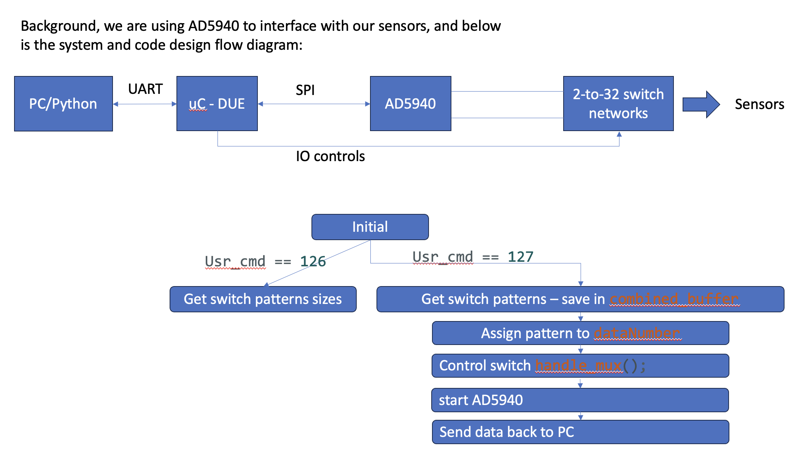

# AD9450

Guide

https://wiki.analog.com/resources/eval/user-guides/ad5940


Problem：

**AD5940_Delay10us(450);**

This would take 450 * 10 us * 56 times = 0.252s


we should avoid this blocking code

Solution:

1. Clearly understand the SPI interaction process


As the measurement of the current time: 0.4s
The real working time: 0.148s
In real working time: the data need to send to the PC this might cost some time, but the data is not too big. Therefore, this is not eager to solve it.

Solutions:

1. Using **Buffer** to store the data (avoid data loss)
2. Using the **DMA** to send it (Non-blocking/non-time-consuming)


Testing plans are also important:

1. Time-consuming analysis


Challenge: No development board to debug, need to come up with as many solutions as possible, and test plans.


The flow chart



## SPI

finish the interface：

[How to port AD594x Firmware Examples to other Micro controller Families [Analog Devices Wiki]](https://wiki.analog.com/resources/eval/user-guides/eval-ad5940/tools/porting_source_code)

To make the chip easier to use, some registers are initialised with non-default values. This is done in function @ref AD5940_Initialize() **Thus it's important to call this function whenever AFE is reset(Power-On-Reset, hardware reset or soft-reset)**

Setting consideration

AD5940BIAStructInit();

```c
//Default：

AppBIACfg_Type *pBIACfg;

AppBIAGetCfg(&pBIACfg);

pBIACfg->SeqStartAddr = 0;
pBIACfg->MaxSeqLen = 512; 
pBIACfg->RcalVal = 10000.0;
pBIACfg->DftNum = DFTNUM_8192;
pBIACfg->NumOfData = -1;      /* Never stop until you stop it manually by AppBIACtrl() function */
pBIACfg->BiaODR = 20;         /* ODR(Sample Rate) 20Hz */  //origin: 1000
pBIACfg->FifoThresh = 4;      /* 4 */
pBIACfg->ADCSinc3Osr = ADCSINC3OSR_2;

//Improve:
//This part need some test to clearly understand each parameters function

AppBIACfg_Type *pBIACfg;

AppBIAGetCfg(&pBIACfg);

pBIACfg->SeqStartAddr = 0;
pBIACfg->MaxSeqLen = 512; 
pBIACfg->RcalVal = 10000.0;
pBIACfg->DftNum = DFTNUM_1024;
//pBIACfg->NumOfData = -1;      /* Never stop until you stop it manually by AppBIACtrl() function */
pBIACfg->NumOfData = 1;		    // stop after one data
pBIACfg->BiaODR = 20;           /* ODR(Sample Rate) 20Hz */  //origin: 1000
pBIACfg->FifoThresh = 4;        /* 4 */
pBIACfg->ADCSinc3Osr = ADCSINC3OSR_2;
```

## DMA

This part is the Arduino development environment:


The serial rate should be some normal rate like **115200, 230400**  (should be multiples of three )


Data transfer is an easy way but for UART it is conflict with the Arduino settings.

```c
#include <stdio.h>
#include "hardware/dma.h"

const char send[] = "Hello world!";
char recv[count_of(send)];

void setup() {
    Serial.begin(115200);
    while (!Serial) {;;}
    
    int channel0 = dma_claim_unused_channel(true);

    dma_channel_config config0 = dma_channel_get_default_config(channel0);
    channel_config_set_transfer_data_size(&config0, DMA_SIZE_8);
    channel_config_set_read_increment(&config0, true);
    channel_config_set_write_increment(&config0, true);

    dma_channel_configure(
        channel0,      
        &config0,          
        recv,         
	    send,           //set as the uart_hw->dr
        count_of(send), 
        true           
    );
    dma_channel_wait_for_finish_blocking(channel0);
    Serial.println(recv);

}

void loop() {
  // put your main code here, to run repeatedly:
}
```

For the Linux Cross-compiling environment

```c

#include <stdio.h>
#include "pico/stdlib.h"
#include "hardware/dma.h"
#include "hardware/structs/uart.h"

// These buffers will be DMA'd to the UART, one after the other.

const char word0[] = "Transferring ";
const char word1[] = "one ";
const char word2[] = "word ";
const char word3[] = "at ";
const char word4[] = "a ";
const char word5[] = "time.\n";

const struct {uint32_t len; const char *data;} control_blocks[] = {
    {count_of(word0) - 1, word0}, 
    {count_of(word1) - 1, word1},
    {count_of(word2) - 1, word2},
    {count_of(word3) - 1, word3},
    {count_of(word4) - 1, word4},
    {count_of(word5) - 1, word5},
    {0, NULL}  
};

int main() {
    stdio_init_all();
    int ctrl_chan = dma_claim_unused_channel(true);
    int data_chan = dma_claim_unused_channel(true);

    dma_channel_config c1 = dma_channel_get_default_config(ctrl_chan);
    channel_config_set_transfer_data_size(&c1, DMA_SIZE_32);
    channel_config_set_read_increment(&c1, true);
    channel_config_set_write_increment(&c1, true);
    channel_config_set_ring(&c1, true, 3); // 1 << 3 byte boundary on write ptr

    dma_channel_configure(
        ctrl_chan,
        &c1,
        &dma_hw->ch[data_chan].al3_transfer_count, // Initial write address
        &control_blocks[0],                        // Initial read address
        2,                                         // Halt after each control block
        false                                      // Don't start yet
    );

    dma_channel_config c1 = dma_channel_get_default_config(data_chan);
    channel_config_set_transfer_data_size(&c1, DMA_SIZE_8);
    channel_config_set_dreq(&c1, uart_get_dreq(uart_default, true));
    // Trigger ctrl_chan when data_chan completes
    channel_config_set_chain_to(&c1, ctrl_chan);
    // Raise the IRQ flag when 0 is written to a trigger register (end of chain):
    channel_config_set_irq_quiet(&c1, true);

    dma_channel_configure(
        data_chan,
        &c1,
        &uart_get_hw(uart_default)->dr,
        NULL,           // Initial read address and transfer count are unimportant;
        0,              // the control channel will reprogram them each time.
        false           // Don't start yet.
    );

    dma_start_channel_mask(1u << ctrl_chan);

    while (!(dma_hw->intr & 1u << data_chan))
        tight_loop_contents();
    dma_hw->ints0 = 1u << data_chan;

    puts("DMA finished.");
}
```