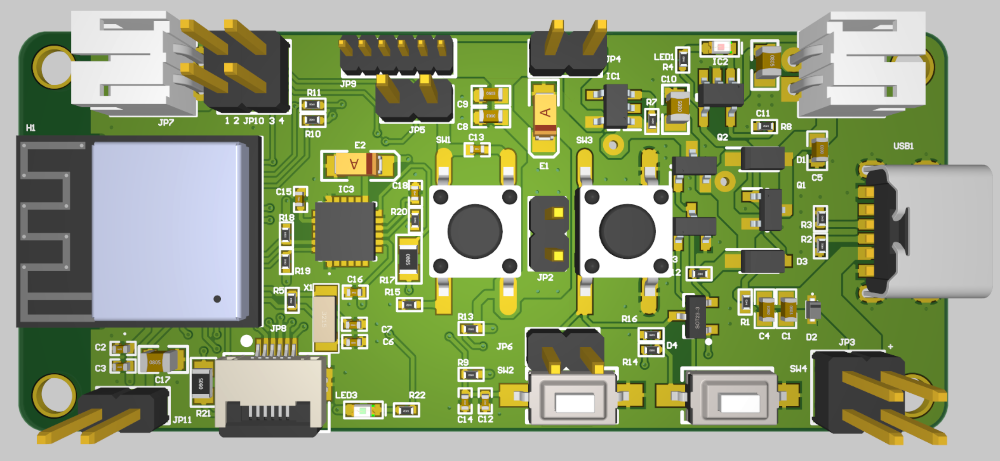
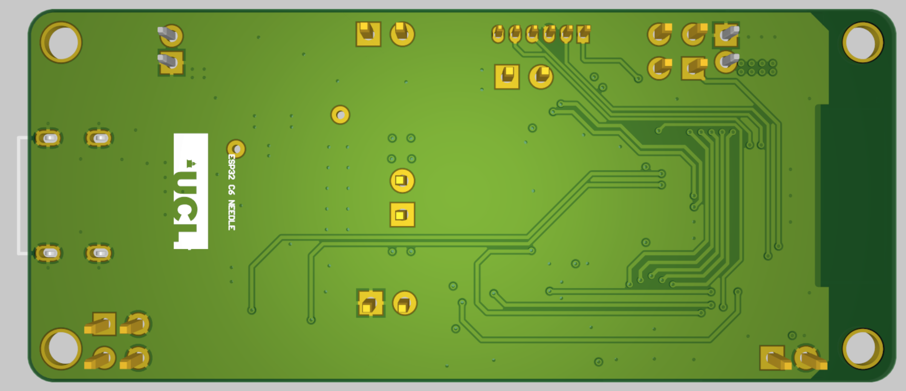

# Instruction

1. **Schematic.pdf** for the schematic
2. **bom.csv** include the items that need for this project

This is the top of the PCB

This is the bottom of the PCB

---
# Main Hardware details

Power
1. AP2112K-3.3TRG1: LDO
2. MCP73831T-2ACI_OT: Charge management

MCU
1. ESP32-C6-MINI-1

IMU:
1. MPU6050