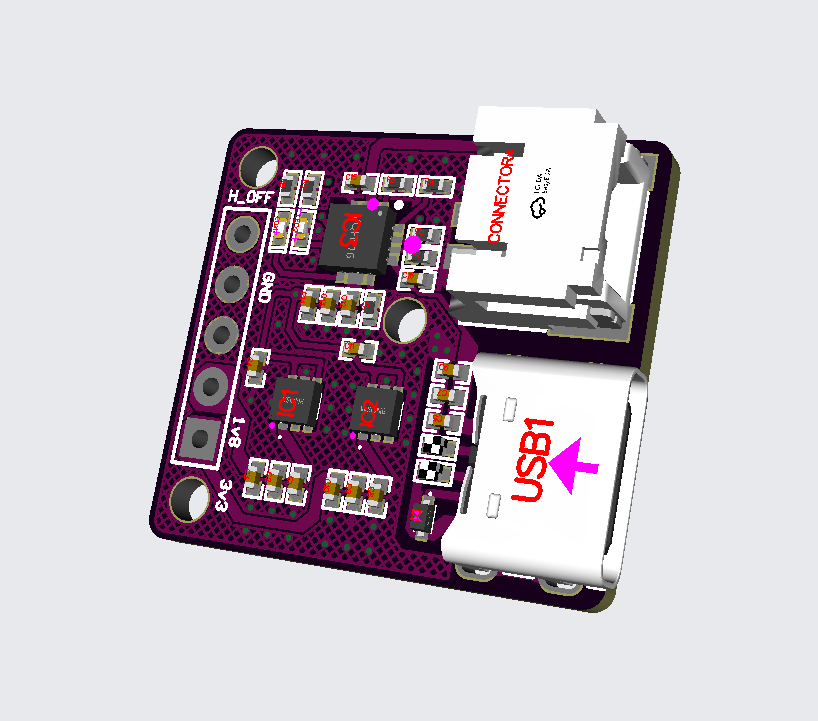
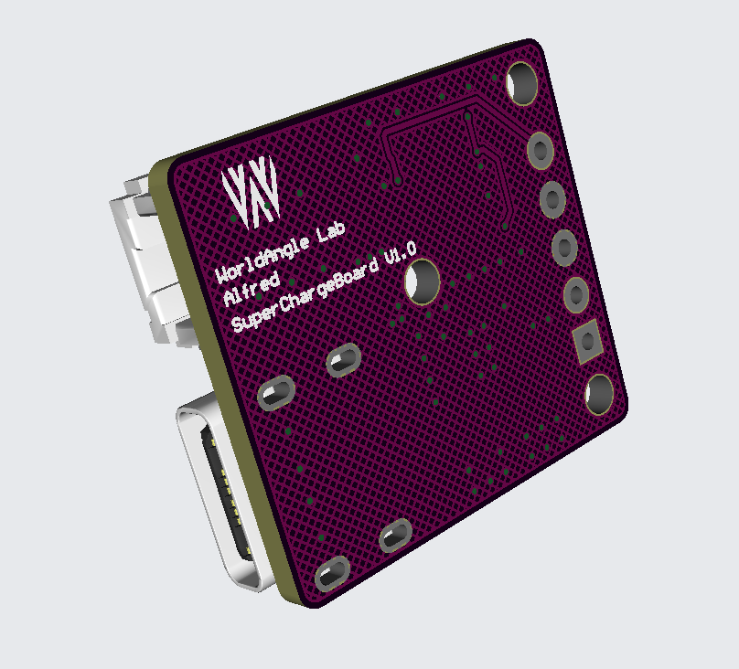
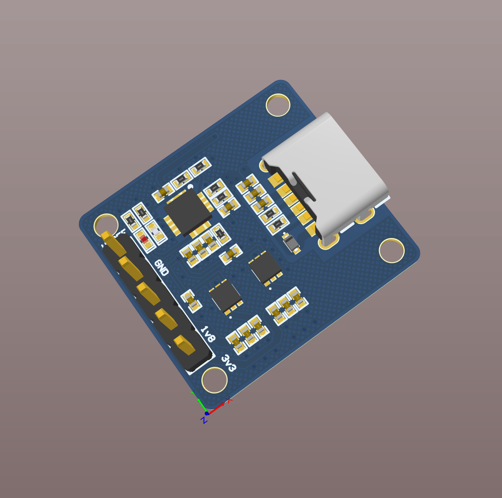
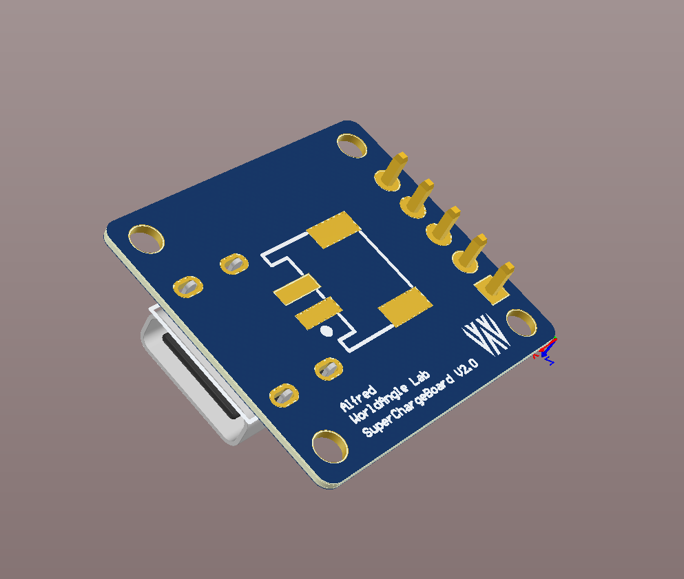

# Battery Charging & Dual LDO Output Board

This board is designed for efficient **battery charging** and **dual regulated voltage output**.

LOG:
V1.0 - TypeC and battery hub are in the same side with three holes for fixed the board
V2.0 - Change the battery hub to the other side and add a hole for fixing the board more stable
---

## 🔋 Charge Management

- **IC**: `BQ24075QRGTRQ1`
- **Function**: Linear battery charger with power path management  
- **Features**:
  - Supports single-cell Li-Ion/Li-Polymer batteries
  - Power path management to charge the battery while powering the system
  - Thermal regulation and safety timers

---

## 🔌 Voltage Output (LDOs)

### ✅ LDO1 – 3.3V Output

- **IC**: `TPS7A2633DRVR`
- **Output Voltage**: 3.3V
- **Features**:
  - Low dropout: ~125 mV at 500 mA
  - High PSRR and low noise
  - Built-in protection (thermal, overcurrent)

---

### ✅ LDO2 – Selectable Output

- **IC Options**:
  - `TPS7A2618DRVR`: 1.8V Output
  - `TPS7A2625DRVR`: 2.5V Output  
- **Choose based on system requirements**
- **Features**:
  - Similar to LDO1: high PSRR, low noise, and full protection features

---

## 📦 Summary

| Function         | Component          | Output       |
|------------------|--------------------|--------------|
| Battery Charging | BQ24075QRGTRQ1     | Single-cell Li-ion charging |
| LDO1             | TPS7A2633DRVR      | 3.3V         |
| LDO2             | TPS7A2618DRVR / TPS7A2625DRVR | 1.8V or 2.5V |

---

## 🧩 Typical Application

- Portable embedded systems
- Sensor modules with dual-voltage requirements
- Wearable electronics with charging and low-noise power rails

---

# Board view

## V1.0

## V2.0

